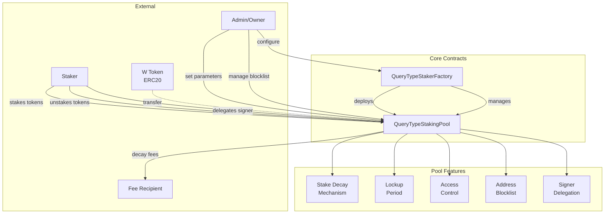

# Wormhole Query Staking System

## About

The Wormhole Query Staking System is a decentralized staking protocol built on Solidity that enables the creation and management of multiple staking pools for different query types. The system implements advanced staking mechanics including stake decay over time, lockup periods, access controls, and signer delegation capabilities. Each staking pool is associated with a unique query type, allowing for flexible and targeted staking incentives across the Wormhole ecosystem.

## Architecture

The system follows a factory pattern with two core contracts:



### Key Components

- **QueryTypeStakerFactory**: Central factory contract that deploys and manages individual staking pools. Each pool is uniquely identified by a query type (bytes32 bit field).

- **QueryTypeStakingPool**: Individual staking pool implementation with:
  - **Stake Decay**: Stakes gradually become claimable by a fee recipient over a configurable time period
  - **Lockup Period**: Initial period where staked tokens cannot be withdrawn
  - **Access Period**: Optional period where only allowlisted addresses can stake
  - **Blocklisting**: Compliance mechanism to prevent specific addresses from participating
  - **Signer Delegation**: Allows stakers to delegate signing authority to another address while maintaining stake ownership

## Development

### Prerequisites

- [Foundry](https://book.getfoundry.sh/getting-started/installation) toolkit installed
- [scopelint](https://github.com/ScopeLift/scopelint) (recommended for formatting and linting)

### Building

```bash
# Standard optimized build
forge build

# Check contract sizes against EIP-170 limit
forge build --sizes

# Fast build without optimization (development)
FOUNDRY_PROFILE=lite forge build
```

### Testing

```bash
# Run all tests
forge test

# Run tests with verbose output
forge test -vvv

# Run specific test
forge test --match-test testFunctionName

# Extensive testing with high fuzz runs (CI profile)
FOUNDRY_PROFILE=ci forge test

# Quick testing with minimal fuzzing (development)
FOUNDRY_PROFILE=lite forge test

# Generate coverage report
forge coverage

# Generate detailed coverage with lcov output
forge coverage --report summary --report lcov
```

### Linting and Formatting

```bash
# Format and check code (recommended)
scopelint fmt
scopelint check

# Alternative: use Forge formatter
forge fmt
```

### Deployment

The project includes deployment scripts that require environment configuration:

```bash
# Deploy contracts
forge script script/Deploy.s.sol --rpc-url <RPC_URL> --broadcast

# Required environment variables:
# PRIVATE_KEY - Deployer's private key
# W_TOKEN_ADDRESS - Address of the W token contract
```

### Development Profiles

The project includes three Foundry profiles optimized for different use cases:

- **default**: Production settings with full optimization (10M optimizer runs)
- **ci**: Continuous integration with extensive fuzz testing (5000 runs)
- **lite**: Fast compilation without optimization for rapid development

⚠ This software is distributed on an "AS IS" BASIS, WITHOUT WARRANTIES OR CONDITIONS OF ANY KIND, either express or implied. See the License for the specific language governing permissions and limitations under the License. Or plainly spoken - this is a very complex piece of software which targets a bleeding-edge, experimental smart contract runtime. Mistakes happen, and no matter how hard you try and whether you pay someone to audit it, it may eat your tokens, set your printer on fire or startle your cat. Cryptocurrencies are a high-risk investment, no matter how fancy.
=======

