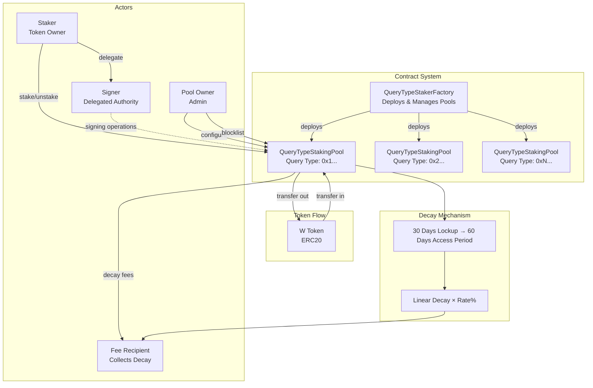

# Wormhole Query Type Staking System

A sophisticated staking protocol for the Wormhole ecosystem that enables targeted incentivization of different query types through dedicated staking pools with time-based decay mechanics.

## Overview

The Wormhole Query Type Staking System is a decentralized staking infrastructure that creates isolated staking pools for different categories of blockchain queries. Each pool implements an innovative decay mechanism where staked tokens gradually become claimable as fees over time, creating a sustainable fee distribution model while maintaining staking incentives.

### Key Features

- **Query-Specific Pools**: Each query type (identified by a `bytes32` bit field) has its own dedicated staking pool
- **Time-Based Stake Decay**: Stakes gradually decay over time, with decayed portions becoming claimable fees
- **Flexible Decay Rates**: Configurable decay rate (0-100%) determines what portion of time-based decay becomes fees
- **Signer Delegation**: Stakers can delegate signing authority to separate addresses (hot wallets)
- **Dual-Period System**: Lockup period for commitment + access period for decay
- **Compliance Controls**: Built-in blocklisting mechanism for regulatory requirements
- **Factory Pattern**: Centralized deployment and management through factory contract

## Architecture



## Stake Decay Mechanism

The decay mechanism is the core innovation of this system, providing a fair and predictable fee distribution model.

### How It Works

1. **Staking**: User stakes tokens for a total period (lockup + access)
2. **Lockup Period** (default 30 days): Tokens are locked, no unstaking allowed
3. **Access Period** (default 60 days): Decay begins, tokens become gradually claimable as fees
4. **Decay Calculation**:

```
Time-based decay = (stakeAmount × timeElapsed) / accessPeriod
Actual fees = Time-based decay × (DECAY_RATE / 100)
```

### Decay Examples

| Decay Rate | Time Elapsed | Original Stake | Decayed to Fees | Remaining Stake |
|------------|--------------|----------------|-----------------|-----------------|
| 100%       | 30 days      | 1000 tokens    | 500 tokens      | 500 tokens      |
| 50%        | 30 days      | 1000 tokens    | 250 tokens      | 750 tokens      |
| 0%         | 30 days      | 1000 tokens    | 0 tokens        | 1000 tokens     |
| 100%       | 60 days      | 1000 tokens    | 1000 tokens     | 0 tokens        |

## Contract Interfaces

### Factory Contract

```solidity
// Deploy a new staking pool for a query type
function createStakingPool(
    bytes32 queryType,        // Unique identifier for the query type
    address poolOwner,        // Admin of the new pool
    bytes32 initialEntry,     // Initial conversion table entry
    uint8 decayRate          // Decay rate percentage (0-100)
) external returns (address)

// Update the fee recipient for all pools
function setFeeRecipient(address newRecipient) external

// Get pool address for a query type
function queryTypeToPools(bytes32 queryType) external view returns (address)
```

### Staking Pool Contract

```solidity
// Stake tokens (automatically claims any existing decay)
function stake(uint256 amount) external

// Unstake tokens (only after lockup period)
function unstake(uint256 amount) external

// Delegate signing authority to another address
function setSigner(address signer) external

// Claim decayed stake as fees (callable by anyone)
function claim(address staker) external

// View staking information
function stakeBalances(address staker) external view returns (uint256)
function stakerSigners(address staker) external view returns (address)
function signerStakers(address signer, address staker) external view returns (bool)
```

### Key Events

```solidity
event Staked(
    address indexed staker,
    uint256 amount,
    uint256 conversionTableIndex,
    uint48 lockupEnd,
    uint48 accessEnd
);

event Unstaked(
    address indexed staker,
    uint256 amount
);

event DecayClaimed(
    address indexed staker,
    uint256 amount,
    address indexed feeRecipient
);

event SignerUpdated(
    address indexed staker,
    address indexed oldSigner,
    address indexed newSigner
);
```

## Development

### Prerequisites

- [Foundry](https://book.getfoundry.sh/getting-started/installation) development toolkit
- [scopelint](https://github.com/ScopeLift/scopelint) for code quality checks

### Building

```bash
# Production build with full optimization
forge build

# Verify contract sizes (must be under 24KB)
forge build --sizes

# Fast development build (no optimization)
FOUNDRY_PROFILE=lite forge build
```

### Testing

```bash
# Run all tests with default settings
forge test

# Verbose output for debugging
forge test -vvvv

# Run specific test
forge test --match-test testStakeDecay

# CI profile: extensive fuzzing (5000 runs)
FOUNDRY_PROFILE=ci forge test

# Development: minimal fuzzing for speed
FOUNDRY_PROFILE=lite forge test
```

### Coverage

```bash
# Generate coverage report
forge coverage

# Detailed coverage with lcov output
forge coverage --report summary --report lcov
```

### Code Quality

```bash
# Format and lint with scopelint
scopelint fmt
scopelint check

# Alternative: Forge formatter
forge fmt
```

### Deployment

```bash
# Deploy to network
forge script script/Deploy.s.sol \
  --rpc-url <RPC_URL> \
  --broadcast \
  --verify

# Required environment variables:
# PRIVATE_KEY - Deployer's private key
# W_TOKEN_ADDRESS - Wormhole token contract address
```

## Integration Guide

### Setting Up a Staking Pool

=======
1. **Deploy Pool via Factory**:
```solidity
address pool = factory.createStakingPool(
    0x0001000000000000000000000000000000000000000000000000000000000000, // Query type
    msg.sender,                                                            // Pool owner
    0x0000000000000000000000000000000000000000000000000000000000000001, // Initial entry
    50                                                                     // 50% decay rate
);
```

2. **Configure Pool Parameters**:
```solidity
pool.setLockupPeriod(30 days);
pool.setAccessPeriod(60 days);
pool.setMinimumStake(100 * 10**18);
pool.setStakingTokenCapacity(1000000 * 10**18);
```

### Staking Operations

```solidity
// Approve tokens first
token.approve(poolAddress, stakeAmount);

// Stake tokens
pool.stake(stakeAmount);

// Delegate signing authority
pool.setSigner(hotWalletAddress);

// Check stake balance (accounting for decay)
uint256 currentBalance = pool.stakeBalances(myAddress);

// Unstake (after lockup period)
pool.unstake(unstakeAmount);
```

## Security Considerations

- **Decay Timing**: Claims are processed atomically with stake/unstake operations to prevent gaming
- **Reentrancy Protection**: Uses checks-effects-interactions pattern
- **Safe Token Handling**: OpenZeppelin's SafeERC20 for all token transfers
- **Access Controls**: Owner-only functions for critical parameters
- **Capacity Limits**: Global and per-staker limits to prevent excessive concentration
- **Blocklisting**: Compliance mechanism that jails stakes while preventing unstaking
- **Immutable Decay Rate**: Cannot be changed after pool deployment to ensure predictability

## Configuration Profiles

| Profile | Optimizer | Runs | Fuzz Runs | Use Case |
|---------|-----------|------|-----------|----------|
| default | Enabled | 10,000,000 | 256 | Production deployment |
| ci | Enabled | 10,000,000 | 5,000 | Continuous integration |
| lite | Disabled | - | 32 | Development |

## License

Apache-2.0

⚠ This software is distributed on an "AS IS" BASIS, WITHOUT WARRANTIES OR CONDITIONS OF ANY KIND, either express or implied. See the License for the specific language governing permissions and limitations under the License. Or plainly spoken - this is a very complex piece of software which targets a bleeding-edge, experimental smart contract runtime. Mistakes happen, and no matter how hard you try and whether you pay someone to audit it, it may eat your tokens, set your printer on fire or startle your cat. Cryptocurrencies are a high-risk investment, no matter how fancy.
=======


